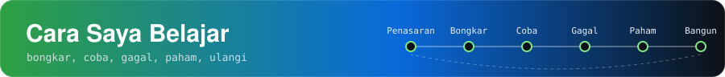
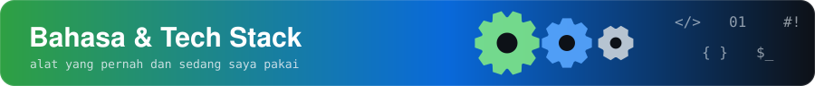
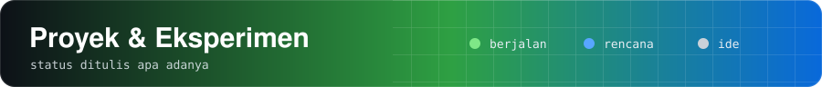
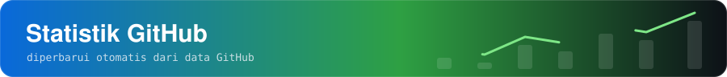

<div align="center">

</div>

```bash
nabil@curiosity:~$ whoami
penggemar-teknologi, hands-on-experimenter, pembelajar-seumur-hidup

nabil@curiosity:~$ cat status.txt
status      : masih belajar, tidak menyebut diri ahli
sekarang    : homelab, jaringan, ESP32, web
cara_belajar: bongkar -> coba -> gagal -> paham -> ulangi
```


<div align="center">

</div>

Saya terus membongkar, bertanya, dan mencoba, sampai akhirnya melihat komputer dan semakin jatuh hati pada perangkat keras, perangkat lunak, dan semua yang ada di antaranya.

Bagi saya, teknologi adalah gabungan **rekayasa, kreativitas, logika, dan pemecahan masalah praktis**. Teknologi sebaiknya membantu manusia, bukan sekadar menggantikannya.

| Info | Detail |
|---|---|
| 👤 **Nama** | Nabil |
| 🎯 **Peran** | Penggemar teknologi & hands-on experimenter |
| 🔭 **Fokus sekarang** | Homelab, jaringan, ESP32, pengembangan web |
| 🌱 **Sedang dipelajari** | Server Linux, RouterOS, Cloudflare Tunnel, Ollama, n8n |
| 🛠️ **Ingin dibangun** | Media Baca Santri, ESP32 Smart Alarm, dashboard informasi pribadi |
| 📷 **Di luar layar** | Astrofotografi, psikologi, otomotif, ekonomi |
| 💬 **Bahasa** | Indonesia |
| ⚡ **Motto** | Pahami sistemnya, jangan cuma memakainya |




- **Bongkar dulu, paham kemudian:** saya ingin tahu apa yang terjadi di balik layar.
- **Belajar dari proyek nyata:** error adalah guru terbaik.
- **Perangkat terbatas bukan halangan:** membuat sesuatu berjalan di perangkat lama itu menyenangkan.
- **Jujur pada proses:** yang baru rencana saya tulis sebagai rencana.


<table>
<tr>
<td width="33%" valign="top">

 **Sudah dicoba**

- Merakit PC & konfigurasi hardware
- Instalasi & troubleshooting OS (Windows 11, Ubuntu Server, Manjaro, Xubuntu)
- Eksperimen frekuensi/voltase CPU & uji stabilitas dasar
- Menjelajah Linux & lingkungan server
- Custom ROM & recovery Android (TWRP)
- Fotografi manual & Lightroom

</td>
<td width="33%" valign="top">

 **Sedang dipelajari**

- Administrasi server Linux
- Homelab & self-hosting
- Jaringan & RouterOS
- Cloudflare Tunnel
- ESP32 & IoT
- Web, database, deployment
- Ollama & n8n
- Dasar kriptografi & keamanan

</td>
<td width="33%" valign="top">

 **Ingin dibangun**

- Media Baca Santri
- ESP32 Smart Alarm
- Dashboard informasi pribadi
- Link nirkabel point-to-point
- Lab AI lokal & otomasi

</td>
</tr>
</table>




**Bahasa pemrograman** (yang pernah dipakai di proyek sendiri, bukan klaim keahlian)

<p>
  
  
  
  
</p>

**Sistem operasi & perangkat** (sudah dicoba langsung)

<p>
  
  
  
  
  
  
  
</p>

**Tools yang sedang dieksplorasi**

<p>
  
  
  
  
  
  
</p>

> Warna badge: biru/hijau = sudah dipakai atau aktif dipelajari, abu-abu = tahap eksplorasi.




> Status ditulis apa adanya. Belum ada tautan repositori karena belum dibuat.

| Proyek | Status | Deskripsi |
|---|---|---|
| **Homelab Pribadi** | 


 | Belajar administrasi server Linux, layanan self-hosted, dan infrastruktur rumah di PC pribadi. |
| **Media Baca Santri** | 


 | Situs bacaan edukasi dengan antarmuka pembaca dan admin terpisah, rencananya di-host sendiri di perangkat berspesifikasi rendah. |
| **ESP32 Smart Alarm** | 


 | Alarm dengan dashboard web berbahasa Indonesia, banyak jadwal, pola dan durasi suara yang bisa diatur, serta tombol stop fisik. |
| **Dashboard Informasi Pribadi** | 


 | Satu antarmuka untuk berita teknologi, data keuangan, ekonomi, dan info harian. |
| **Lab Jaringan Rumah** | 


 | Router, switch, akses jarak jauh, dan link point-to-point antarlokasi. |
| **Lab AI Lokal & Otomasi** | 


 | Mencoba Ollama dan n8n untuk alur kerja otomatis. |


```yaml
desktop:
  motherboard : MSI B550M PRO-VDH
  cpu         : AMD Ryzen 5 5500GT (Radeon Vega 7)
  ram         : 8 GB DDR4 3200 MHz (single-channel)
  storage     : MSI Spatium M371 500 GB + HDD untuk eksperimen server
  psu         : Acer modular 550 W 80+
  os_dicoba   : [Windows 11, Ubuntu Server, Manjaro, Xubuntu]
mikrokontroler: [ESP32 WROOM, ESP32-S3]
```




<table>
<tr>
<td width="50%" valign="top">

 **Fotografi & astrofotografi**
Milky Way, sawah, dan lanskap pedesaan dengan ponsel, kontrol manual, tripod, dan lensa tambahan. Disunting hangat di Lightroom.

</td>
<td width="50%" valign="top">

 **Psikologi**
Tertarik pada cara orang berpikir dan mengambil keputusan.

</td>
</tr>
<tr>
<td width="50%" valign="top">

 **Otomotif**
Sistem mekanik dan elektronik yang bekerja bersama.

</td>
<td width="50%" valign="top">

 **Keuangan & ekonomi**
Pasar, kripto, dan perkembangan ekonomi sebagai bahan belajar.

</td>
</tr>
</table>




<p align="center">
  <picture>
    <source media="(prefers-color-scheme: dark)" srcset="https://github-readme-stats.vercel.app/api?username=akmalnabill&show_icons=true&hide_border=true&bg_color=0d1117&title_color=2ea043&icon_color=0969da&text_color=c9d1d9&count_private=true" />
    
  </picture>
</p>

<p align="center">
  <picture>
    <source media="(prefers-color-scheme: dark)" srcset="https://streak-stats.demolab.com?user=akmalnabill&hide_border=true&background=0d1117&ring=2ea043&fire=0969da&currStreakLabel=2ea043&sideLabels=c9d1d9&currStreakNum=c9d1d9&sideNums=c9d1d9&dates=8b949e" />
    
  </picture>
</p>

<p align="center">
  
</p>


